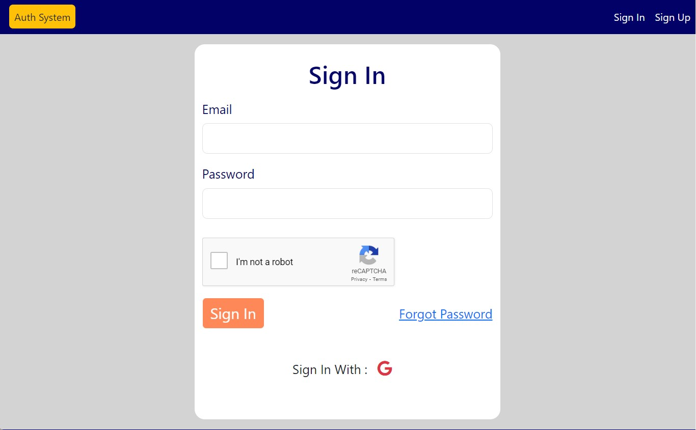
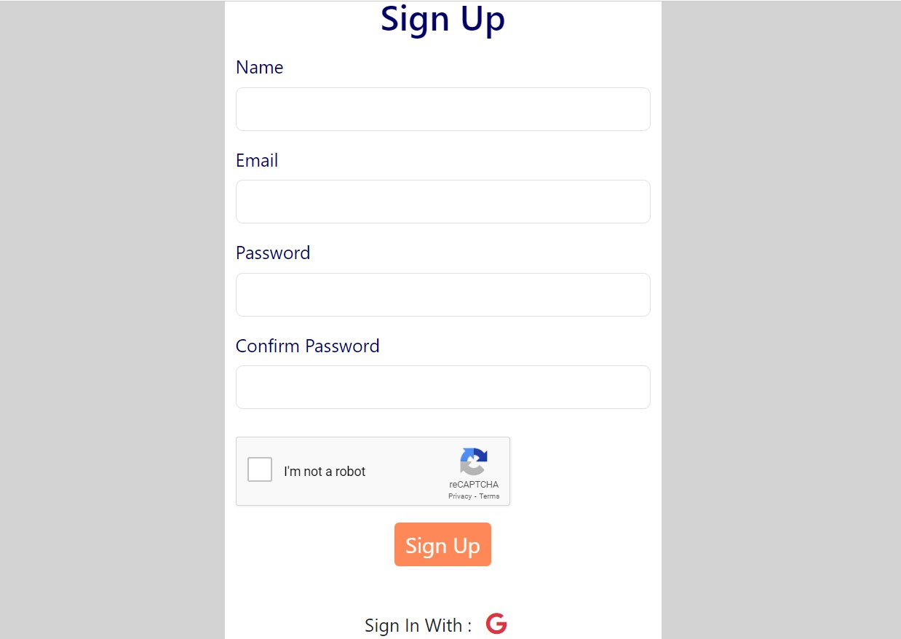
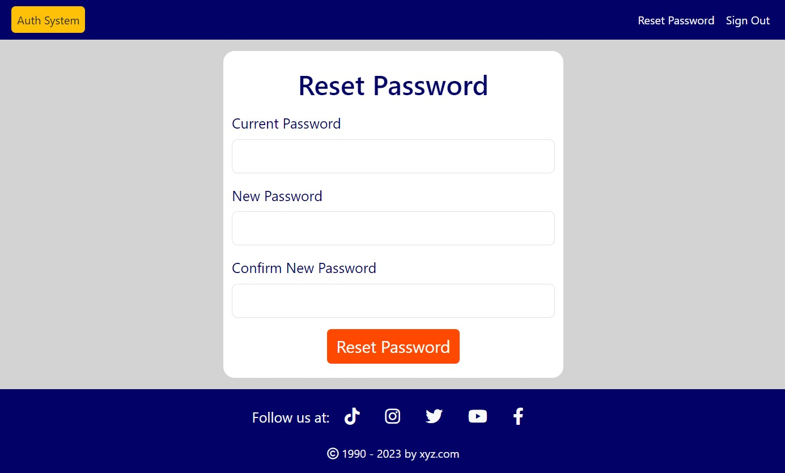
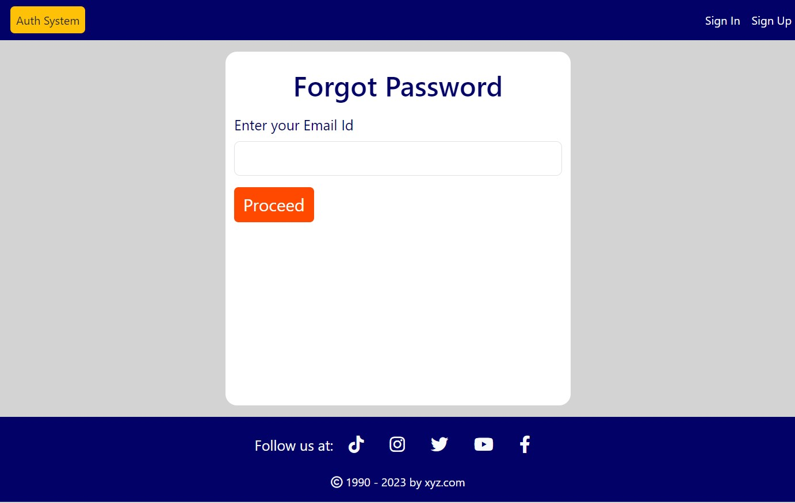
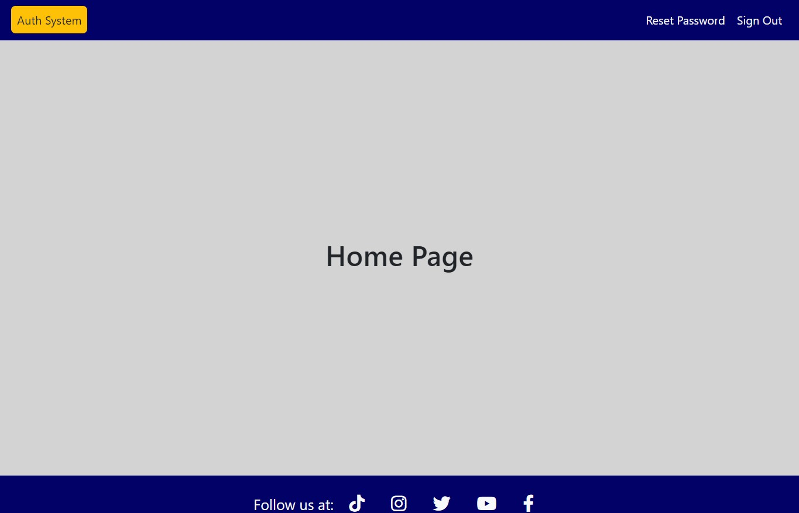

# NodeJS Authentication
A complete authentication system which can be used as a starter code for creating any new application.

## Functionalities
1.  Sign In/ Sign Up

    Create new user with Sign Up form. Otherwise Sign In if user already exists.

    

    

    > User can also login using Google, by clicking G icon below form.

    > Also included Google's reCaptcha verification.

2. Reset password

    After successful login user can reset his password.

    

    > User logged in using Google will not be able to use this option.

3. Forgot password

    User can reset his password using forgot password option on sign in page.

    A link to reset password will be sent to user's registered email address. User have to enter his email address.

    

    > Password reset link will expire in 5 minutes.

4. Home page

    You can redirect to a blank home page with a sign out and reset password button after sign in.

    

5. Notifications

    Implemented notifications for various messages during app run using connect-flash and notyJS CDN.

## Getting Started with Auth System

This project uses Bootstrap to style.
After you have this project in your machine.

**To setup:**

`Google Account`

1. Create credentials for authentication

    Go to [Google Developer Console](https://console.cloud.google.com/apis/dashboard).

    Create OAuth credentials. Follow the steps suggested by Google.

    > Use same redirect URL as given in app. You can define your own but remember to change it here in app also.

    > Use Javascript origin as your host. In my case it is http://localhost:8000

2. Create key for Google reCaptcha

    You have to create key for reCaptcha. Follow the steps as per the below document.

    [Creating reCAPTCHA keys](https://cloud.google.com/recaptcha-enterprise/docs/create-key)

3. Create an App Password

    Create an App Password for Google account you will use to send mails.

    For that go to your google account settings.

    Then 2 factor authentication.

    Create App Password.

> After setting creating this credentials, update env.js file with credentials created by you.

> You can update other variables too. But take care of other dependency for that variables.

> Also ensure redis-server is installed and running in your system. Kue will not work without it.

`npm install`

Installs all the dependencies for App that are present in package.json file.

> You can modify secret keys within env.js file & also MongoDB url if required.

**In the project directory, you can run:**

`npm start`

Runs the app.
Open [http://localhost:8000](http://localhost:8000) to view it in your browser.

> You can change port number by modifying env.js file.
